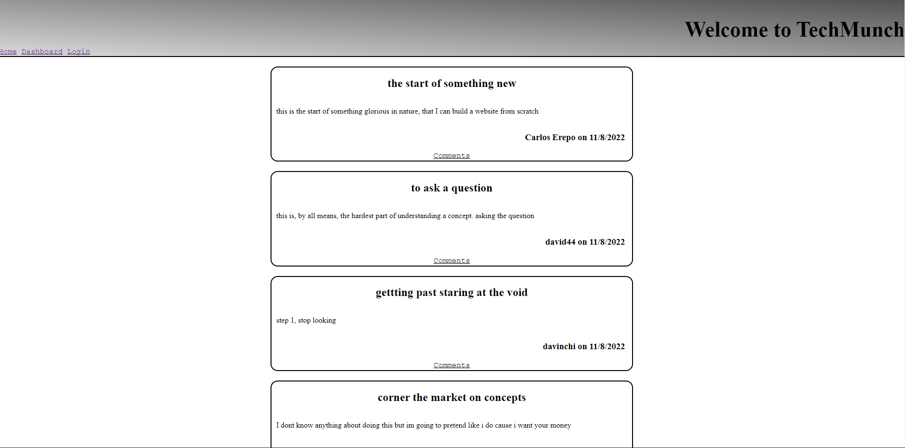

# tech-blog


## Deployed link
* [tech blog](https://sivad-tech-blog.herokuapp.com/)

## site picture



## Technologies Used
- HTML : Used to format the content of the page
- CSS : Used to style the HTML on the web browser
- JavaScript : Used to give the page logical functions and a dynamic interface
- Git : Used to version control the code during the creation process
- GitHub : hosting the repositroy responsible for the website

## Authors
- writen styled and built by Mason Davis

## summary
This repository contains all the code to generate a tech blog, it has a log in user accounts, password protection, posts comments and delete ability. 

## Code Snippet
This is a snippet Showing the formula used to generate the password and hash it. this is integral in protecting user data.

```javaScript
 async beforeCreate(newUserData) {
        newUserData.password = await bcrypt.hashSync(newUserData.password, 10);
        return newUserData;
      }      
```


## Author links
[LinkedIn](https://www.linkedin.com/in/davis-mason-t/)
[GitHub](https://github.com/Md7113)